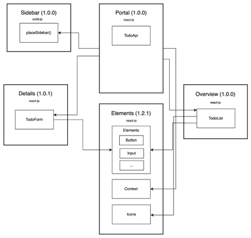
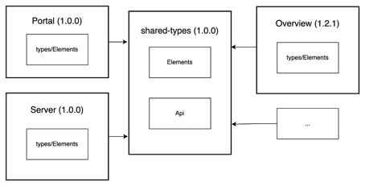

# Todo-Microfrontend 

Ein Microfrontend Proof of Concept mit React, Solid und Nest als Server.

# Stack
- Backend: Node.js v23.5 NestJS
- Frontend: ReactJS und SolidJS 

# Architektur

### nach Module-Federation 



### Für Typescript Types (analog zur NPM-Library umgesetzt durch npm link)

 


# Installation und Starten

Um die Abhängigkeiten der Anwendung zu installieren ist ein setup script entwickelt worden. </br>
Das Script installiert alle Entwicklungsabhängigkeiten sowie Gesamtabhängigkeiten installiert, </br>
anschließend werden für Typescript die Types via ```npm Link``` angehängt. In einem realen Ent- </br>
wicklungsfall sollten andere Lösungen als den npm-Library Ansatz überlegt werden.

#### Navigation zum Portal

``` cd  src/Portal ```

#### Installationsscript ausführen

``` npm run setup ```

#### Anwendung starten

Hierfür wird npm-run-all parallel genutzt, dadurch können mehrere Services in einem Terminal parallel laufen.

``` npm run start:all ```

#### Brower mit localhost:3000 aufrufen

anklicken: http://localhost:3000
